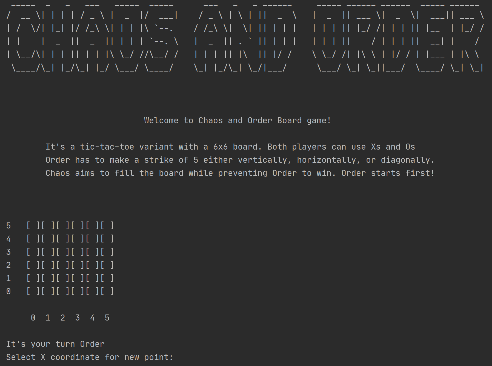

# Order and Chaos

### Authors:
- **Marco Franzon**
- **Tommaso Rodani**

### About the game
Order and Chaos is a variant of tic-tac-toe on a 6x6 board where both players can use *X* or *O*.
Order start first and has to make a strike of 5 either vertically, horizontally, or diagonally.
If one or more of these streaks exists order wins otherwise chaos wins when the board is full.

### Compile and run

    ./gradlew OrderandChaos --console=plain